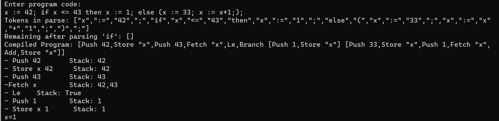

# TP2 Coursework-Haskell

T03_G07

André Bernardo Ferreira Santos (up202108658) - 50%

Inês Ferreira de Almeida (up202004513) - 50%

## Introduction

Here, we explore the implementation of a low-level machine and a simple imperative programming language in Haskell. This assignment bridges the gap between abstract programming concepts and practical application, showcasing the versatility of Haskell in handling complex tasks.

## 1. Machine Implementation

The first part of the assignment involves building a low-level machine with a configuration comprising code, an evaluation stack, and storage. It focuses on executing arithmetic and boolean expressions using a set of instructions like push, add, mult, sub, and more. The task includes defining types for the machine's stack (`Stack`) and state (`State`), and implementing functions such as `createEmptyStack`, `stack2Str`, and an interpreter function `run`.

The `Inst` data type defines instructions for a basic computational machine, including arithmetic (`Add`, `Mult`, `Sub`), boolean operations (`Tru`, `Fals`, `Equ`, `Le`, `And`, `Neg`), memory operations (`Fetch`, `Store`), and control flow (`Branch`, `Loop`). `Code` is a sequence of these instructions.

```haskell
data Inst =
  Push Integer | Add | Mult | Sub | Tru | Fals | Equ | Le | And | Neg |
  Fetch String | Store String |
  Branch Code Code | Loop Code Code
  deriving Show
type Code = [Inst]
```

### a) Stack

The `StackVal` type in represents values that can be stored on a stack, including integers (`IVal`) and booleans (`BVal`). `Stack` is a list of these `StackVal` items, allowing for diverse data types to be handled in a unified stack structure.

```haskell
data StackVal = IVal Integer | BVal Bool | TVal String deriving (Show, Eq)
type Stack = [StackVal]
```

### b) State

The `State` type in represents the state of the machine, consisting of a `Stack` and a list of variable-value pairs (where variables are strings and values are `StackVal` items). This structure facilitates tracking both the current stack and variable bindings in the machine's memory.

```haskell
type State = (Stack, [(String, StackVal)])
```

### c) Create Empty Stack

The `createEmptyStack` function in is defined to initialize an empty stack, returning an empty list `[]`. This function is used to create a new, empty `Stack` for use in the machine's state.

```haskell
createEmptyStack :: Stack
createEmptyStack = []
```

### d) Create Empty State

The `createEmptyState` function in sets up an initial, empty state for the machine. It combines an empty stack, created by `createEmptyStack`, with an empty list for variable-value pairs, forming a complete but empty `State` tuple. This function is essential for initializing the machine's state with no pre-existing data.

```haskell
createEmptyState :: State
createEmptyState = (createEmptyStack, [])
```

### e) Stack to String

The `stack2Str` function converts a stack into a comma-separated string representation. It utilizes `showStackVal` to transform each `StackVal` item (integers, booleans, or strings) into its corresponding string form. The function `showStackVal` specifically handles the conversion, turning integer values (`IVal`) into their numeric strings, and boolean values (`BVal`) into `"True"` or `"False"`.

```haskell
stack2Str :: Stack -> String
stack2Str stack = intercalate "," (map showStackVal stack)

showStackVal :: StackVal -> String
showStackVal (IVal n) = show n
showStackVal (BVal True) = "True"
showStackVal (BVal False) = "False"
```

### f) State to String

The `state2Str` function converts the state's storage into a string representation. It formats each variable-value pair in the storage as "variable=value," sorting them alphabetically by variable name. This function handles different types of values: integers (`IVal`) and booleans (`BVal`) converting each to its appropriate string format.

```haskell
state2Str :: State -> String
state2Str (_, store) =
    intercalate "," . map showVarVal . sortBy (comparing fst) $ store
  where
    -- Converts variable-value pairs to a printable string
    showVarVal :: (String, StackVal) -> String
    showVarVal (var, IVal n) = var ++ "=" ++ show n
    showVarVal (var, BVal True) = var ++ "=True"
    showVarVal (var, BVal False) = var ++ "=False"
    showVarVal (var, TVal s) = var ++ "=" ++ s
```

### g) Run

```haskell
run :: (Code, Stack, State) -> (Code, Stack, State)
```

The `run` function serves as the core interpreter for the low-level machine implemented in Haskell. It processes a tuple consisting of code, stack, and state, and executes the instructions recursively. Here’s a summarized explanation:

#### Base Case

When no code is left to execute (`[]`), the function returns the current stack and state, marking the completion of execution.

```haskell
run ([], stack, state) = ([], stack, state)
```

#### Push Operation

Adds a number to the stack and continues execution.

```haskell
run ((Push n):code, stack, state) =
    trace ("- Push " ++ show n ++ "\tStack: " ++ stack2Str (IVal n : stack)) $
    run (code, IVal n : stack, state)
```

#### Arithmetic Operations (`Add`, `Sub`, `Mult`)

Performs the specified arithmetic operation on the top two integers from the stack and updates the stack with the result.

```haskell
run (Add:code, IVal n1 : IVal n2 : stack, state) =
    trace ("- Add " ++ show (n1 + n2) ++ "\tStack: " ++ stack2Str (IVal (n1 + n2) : stack)) $
    run (code, IVal (n1 + n2) : stack, state)
run (Sub:code, IVal n1 : IVal n2 : stack, state) =
    trace ("- Sub " ++ show (n1 + n2) ++ "\tStack: " ++ stack2Str (IVal (n1 + n2) : stack)) $
    run (code, IVal (n1 - n2) : stack, state)
run (Mult:code, IVal n1 : IVal n2 : stack, state) =
    trace ("- Mult " ++ show (n1 + n2) ++ "\tStack: " ++ stack2Str (IVal (n1 + n2) : stack)) $
    run (code, IVal (n1 * n2) : stack, state)
```

#### Boolean Constants (Tru, Fals)

Pushes the respective Boolean value onto the stack.

```haskell
run (Tru:code, stack, state) =
    trace ("- Tru \tStack: " ++ stack2Str (BVal True : stack)) $
    run (code, BVal True : stack, state)
run (Fals:code, stack, state) =
    trace ("- Fals \tStack: " ++ stack2Str (BVal True : stack)) $
    run (code, BVal False : stack, state)
```

#### Store and Fetch Operations

`Store` updates the state with a variable's value.

```haskell
run ((Store var):code, val:stack, (s, store)) =
    let updatedStore = updateStore var val store
    in trace ("- Store " ++ var ++ " " ++ showStackVal val ++ "\t Stack: " ++ stack2Str (val : stack)) $
       run (code, stack, (s, updatedStore))
  where
    updateStore var val [] = [(var, val)]
    updateStore var val ((v,sVal):vs)
      | v == var  = (var, val) : vs
      | otherwise = (v, sVal) : updateStore var val vs
```

`Fetch` retrieves a variable's value from the state and pushes it onto the stack.

```haskell
run ((Fetch varName):code, stack, state@(_, store)) =
    case lookup varName store of
        Just val -> trace ("-Fetch " ++ varName ++ "\tStack: " ++ stack2Str (val : stack)) $ 
                    run (code, val : stack, state)
        Nothing  -> error "Run-time error"  
```

#### Negation

`Neg` negates a Boolean value on the stack.

```haskell
run (Neg:code, BVal b : stack, state) =
    trace ("- Neg: " ++ show code ++ "\tStack: " ++ stack2Str (BVal (not b) : stack)) $
    run (code, BVal (not b) : stack, state)
run (Neg:code, stack, state) =
    error "Neg instruction expects a boolean value on top of the stack"
```

#### Equality (`Equ`) and Less-Than-or-Equal (`Le`):

Performs equality and less-than-or-equal comparisons between the top values on the stack.

```haskell
run (Equ:code, v1 : v2 : stack, state) =
    trace ("- Equ " ++ show code ++ "\tStack: " ++ stack2Str (BVal (v1 == v2): stack)) $
    run (code, BVal (v1 == v2) : stack, state)

run (Le:code, IVal n1 : IVal n2 : stack, state) =
    trace ("- Le "  ++ "\tStack: " ++ stack2Str (BVal (n1 <= n2): stack)) $
    run (code, BVal (n1 <= n2) : stack, state)  -- Ensure that n1 is the last pushed value
run (Le:_, _, _) =
    error "Le instruction requires two integer values on top of the stack"
```

#### Logical And

`And` performs a logical AND operation on the top two Boolean values from the stack.

```haskell
run (And:code, BVal b1 : BVal b2 : stack, state) =
    trace ("- And: " ++ show code ++ "\tStack: " ++ stack2Str (BVal (b1 && b2): stack)) $
    run (code, BVal (b1 && b2) : stack, state)
run (And:_, _, _) =
    error "Runtime error: 'And' operation requires two boolean values on top of the stack"
```

#### Branching

`Branch` executes conditional code based on the evaluated condition.

```haskell
run ((Branch condCode thenCode):restCode, stack, state) =
  case stack of
    (BVal True : stack') -> run (condCode ++ restCode, stack', state)
    (BVal False : stack') -> run (thenCode ++ restCode, stack', state) -- No 'elseCode' in this case
    _ -> error "Branch condition did not evaluate to a boolean"
```

#### Looping 

`Loop` continuously executes the loop body as long as the condition is true.

```haskell
run (Loop condition body:restCode, stack, state) = 
    let (_, conditionStack, _) = run (condition, stack, state)
    in if getConditionResult conditionStack
       then let (_, bodyStack, bodyState) = run (body, stack, state)
            in run (Loop condition body:restCode, bodyStack, bodyState)
       else run (restCode, stack, state)
```

#### Error Handling

`run` includes a catch-all error handler for unhandled instructions, ensuring any unexpected or unsupported instructions are flagged immediately.

```haskell
run (inst : restCode, stack, state) =
  error $ "Unhandled instruction: " ++ show inst
```

#### Trace

The `trace` statements are used for debugging. These statements provide insights into each operation performed and the state of the stack thereafter.

Overall, the `run` function is a critical component of our Haskell-based interpreter, showcasing the practical application of recursion and pattern matching in functional programming. Its design and implementation highlight the efficiency of Haskell in handling complex computational tasks.

## 2. Programming Language Development

This part of the assignment involves creating a small imperative programming language that compiles into instructions for the previously defined low-level machine. It includes arithmetic and boolean expressions, assignments, sequences, conditionals, and loops. Key tasks are defining Haskell data types (`Aexp` for arithmetic expressions, `Bexp` for boolean expressions, and `Stm` for statements) and developing a compiler to translate these high-level constructs into the low-level machine's code. Additionally, a parser is required to convert string representations of programs into structured data, adhering to specific syntactic rules.

### a) Data types that define the structure of the imperative programming language


'Aexp' data type models arithmetic expressions with integer literals (`ALit`), variables (`AVar`), and operations like addition (`AAdd`), subtraction (`ASub`), multiplication (`AMul`), and division (`ADiv`).

```haskell
data Aexp = ALit Integer
          | AVar String
          | AAdd Aexp Aexp
          | ASub Aexp Aexp
          | AMul Aexp Aexp
          | ADiv Aexp Aexp

          deriving Show
```

`Bexp` data type represents boolean expressions. It includes boolean literals (`BLit`), equality (`BEq`) and less-than-or-equal comparisons (`BLe`) between arithmetic expressions, logical operations like and (`BAnd`), or (`BOr`), and negation (`BNot`), as well as constants for true (`BTrue`) and false (`BFalse`).

```haskell
data Bexp = BLit Bool
          | BEq Aexp Aexp
          | BLe Aexp Aexp
          | BAnd Bexp Bexp
          | BOr Bexp Bexp
          | BNot Bexp
          | BTrue
          | BFalse
          deriving Show
```

`Stm` describes statements in the language, including variable assignment, sequences of statements, conditional if-then-else structures, while loops, and a noop (no operation) statement.

```haskell
data Stm = SAssign String Aexp
         | SSeq Stm Stm
         | SIf Bexp Stm Stm
         | SWhile Bexp Stm
         | Noop
         deriving Show
```

### b) Compiler

`compA` translates arithmetic expressions (`Aexp`) into machine code, handling literals, variables and basic arithmetic operations. 

```haskell
compA :: Aexp -> Code
compA (ALit n) = [Push n]
compA (AVar x) = [Fetch x]
compA (AAdd a1 a2) = compA a2 ++ compA a1 ++ [Add]
compA (ASub a1 a2) = compA a2 ++ compA a1 ++ [Sub]
compA (AMul a1 a2) = compA a2 ++ compA a1 ++ [Mult]
```

`compB` translates boolean expressions (`Bexp`) into a sequence of machine code instructions. It handles boolean literals (`BLit`), compares arithmetic expressions for equality (`BEq`) and less-than-or-equal (`BLe`), performs logical operations like and (`BAnd`), and applies negation (`BNot`). Additionally, it directly translates boolean constants true (`BTrue`) and false (`BFalse`) into their respective instructions. 

```haskell
compB :: Bexp -> Code
compB (BLit b) = [if b then Tru else Fals]
compB (BEq a1 a2) = compA a2 ++ compA a1 ++ [Equ]
compB (BLe a1 a2) = compA a2 ++ compA a1 ++ [Le]
compB (BAnd b1 b2) = compB b1 ++ compB b2 ++ [And]
compB (BNot b) = compB b ++ [Neg]
compB (BTrue) = [Tru]
compB (BFalse) = [Fals]
```

`compileStm` converts statements (`Stm`) like assignments, sequences, conditionals, and loops into code. 

```haskell
compileStm :: Stm -> Code
compileStm (SAssign x a) = compA a ++ [Store x]
compileStm (SSeq s1 s2) = compileStm s1 ++ compileStm s2
compileStm (SIf b s1 s2) = compB b ++ [Branch (compileStm s1) (compileStm s2)]
compileStm (SWhile b s) = [Loop (compB b) (compileStm s)]
compileStm Noop = [] 
```

The main `compile` function aggregates these conversions for a list of statements, forming the compiled program.

```haskell
compile :: [Stm] -> Code
compile statements = concatMap compileStm statements
```

### c) Parser

The parser is an essential component of our project, responsible for converting a textual representation of our programming language into a structured format. This structured data can then be compiled into machine code or directly interpreted. The parser is designed to understand and enforce the syntax rules of our language, handling various elements like expressions, control flow statements, and logical operations.

#### Lexer `lexer`

`lexer` breaks down the input string into a list of tokens. Tokens are the smallest units in the language, like keywords, operators, and identifiers.
It identifies different types of tokens: spaces, alphabets (for variable names), digits (for numbers), and special symbols for operations like assignment (`:=`), comparison (`==`, `<=`), logical operators (`&&`, `||`), and others.

```haskell
lexer :: String -> [String]
lexer [] = []
lexer (c:cs)
  | isSpace c = lexer cs
  | isAlpha c = let (token, rest) = span isAlpha (c:cs) in token : lexer rest
  | isDigit c = let (token, rest) = span isDigit (c:cs) in token : lexer rest
  | c == ':' && not (null cs) && head cs == '=' = ":=" : lexer (tail cs)
  | c == '=' && not (null cs) && head cs == '=' = "==" : lexer (tail cs)
  | c == '=' = "=" : lexer cs
  | c == '<' && not (null cs) && head cs == '=' = "<=" : lexer (tail cs)
  | c == '&' && not (null cs) && head cs == '&' = "&&" : lexer (tail cs)
  | c == '|' && not (null cs) && head cs == '|' = "||" : lexer (tail cs)
  | c `elem` "+-*/:;(){}" = [c] : lexer cs
  | otherwise = error $ "Unexpected character: " ++ [c]
```

#### Statement Parsing (`parseStm` and `parseStm'`)

`parseStm` acts as the entry point for statement parsing. It checks for empty input, returning a Noop statement, or calls parseStm' for further processing.

```haskell
parseStm :: [String] -> Either String (Stm, [String])
parseStm [] = Right (Noop, [])
parseStm tokens = parseStm' tokens []

```

`parseStm'` handles sequences of statements. It parses individual statements, looks for semicolons as separators, and recursively processes the statements to maintain their sequence. It also checks for syntax errors like missing semicolons.

```haskell

parseStm' :: [String] -> [Stm] -> Either String (Stm, [String])
parseStm' [] stms = Right (foldr1 SSeq (reverse stms), [])
parseStm' tokens stms = do
  (stm, remainingTokens) <- parseStmPart tokens
  if null remainingTokens
    then Right (foldr1 SSeq (reverse (stm : stms)), [])
    else case remainingTokens of
      ";" : rest -> parseStm' rest (stm : stms)
      _ -> Left $ "parseStm': expected semicolon after statement, got " 
```

#### Parsing Individual Statement Parts `parseStmPart`

`parseStmPart` deals with parsing different types of statements, like assignments, `if` conditions, and `while` loops. It uses specific functions like `parseIf` and `parseWhile` for detailed parsing of these constructs.

```haskell
parseStmPart :: [String] -> Either String (Stm, [String])
parseStmPart [] = Left "parseStmPart: unexpected end of input"
parseStmPart ("if" : rest) = do
    (ifStm, remaining) <- parseIf ("if" : rest)
    trace ("Remaining after parsing 'if': " ++ show remaining) $ do
        (restStm, remaining') <- parseStm remaining
        Right (SSeq ifStm restStm, remaining')
parseStmPart ("while" : rest) = parseWhile ("while" : rest)
parseStmPart (var : ":=" : rest) = do
  (expr, rest') <- parseAexp rest
  Right (SAssign var expr, rest')
parseStmPart unexpected = Left $ "Unexpected statement: " ++ unwords unexpected
```
#### Arithmetic Expression Parsing (`parseAexp`, `parseAddSub`, `parseMulDiv`, `parseTerm`)

These functions collectively parse arithmetic expressions. `parseAexp` initiates the process, handling addition and subtraction, while `parseMulDiv` and `parseTerm` delve into multiplication, division, and basic terms.

```haskell
--Parses arithmetic
parseAexp :: [String] -> Either String (Aexp, [String])
parseAexp tokens =
  if not (null tokens) && head tokens == "(" && last tokens == ")"
    then parseAddSub (init (tail tokens))
    else parseAddSub tokens

-- Parses addition and subtraction expressions from a list of tokens
parseAddSub :: [String] -> Either String (Aexp, [String])
parseAddSub tokens = do
  (term1, rest) <- parseMulDiv tokens
  parseAddSub' rest term1

-- Parses addition and subtraction operators from a list of tokens
parseAddSub' :: [String] -> Aexp -> Either String (Aexp, [String])
parseAddSub' [] expr = Right (expr, [])
parseAddSub' (op : tokens) expr
  | op `elem` ["+", "-"] = do
    (term, rest) <- parseMulDiv tokens
    case op of
      "+" -> parseAddSub' rest (AAdd expr term)
      "-" -> parseAddSub' rest (ASub expr term)
      _   -> Left "Unexpected operator"
  | otherwise = Right (expr, op : tokens)

-- Parses multiplication and division expressions from a list of tokens
parseMulDiv :: [String] -> Either String (Aexp, [String])
parseMulDiv tokens = do
  (factor1, rest) <- parseTerm tokens
  parseMulDiv' rest factor1

-- Parses multiplication and division operators from a list of tokens
parseMulDiv' :: [String] -> Aexp -> Either String (Aexp, [String])
parseMulDiv' [] expr = Right (expr, [])
parseMulDiv' (op : tokens) expr
  | op `elem` ["*", "/"] = do
    (factor, rest) <- parseTerm tokens
    case op of
      "*" -> parseMulDiv' rest (AMul expr factor)
      "/" -> parseMulDiv' rest (ADiv expr factor)
      _   -> Left "Unexpected operator"
  | otherwise = Right (expr, op : tokens)

-- Parses individual terms (numbers, variables, or sub-expressions in parentheses)
parseTerm :: [String] -> Either String (Aexp, [String])
parseTerm [] = Left "parseTerm: unexpected end of input"
parseTerm ("(":rest) = do
  (exp, restTokens) <- parseAexp rest
  case restTokens of
    [] -> Left "parseTerm: missing closing parenthesis"
    (")":moreTokens) -> Right (exp, moreTokens)
    _ -> Left "parseTerm: missing closing parenthesis"
parseTerm (x:xs)
  | all isDigit x = Right (ALit (read x), xs)
  | isAlpha (head x) && all isLower x = Right (AVar x, xs)
  | otherwise = Left $ "parseTerm: unexpected token " ++ x
```

#### Complex Boolean Expression Parsing `parseComplexBexp`

`parseComplexBexp` manages the parsing of boolean expressions, including logical operations, negation, and comparisons. It supports nested expressions and differentiates between various boolean operators.

```haskell
parseComplexBexp :: [String] -> Either String (Bexp, [String])
parseComplexBexp tokens = do
    if head tokens == "(" && last tokens == ")"
      then do parseComplexBexp (init (tail tokens)) 
    else if "and" `elem` tokens || "=" `elem` tokens
      then do
        let (beforeAnd, (_:afterAnd)) = break (`elem` ["and", "="]) tokens
        (exp1, _) <- parseComplexBexp beforeAnd
        (exp2, remaining) <- parseComplexBexp afterAnd
        let comparison = BAnd exp1 exp2
        if null remaining
          then Right (comparison, remaining)
          else do
            (restOfBexp, finalTokens) <- parseComplexBexp remaining
            Right (comparison, finalTokens)
    else if head tokens == "not"
          then if length tokens > 1 && head (tail tokens) == "("
              then do
                  let matchingIndex = findMatchingIndex tokens 0 0
                      (innerBexp, remaining) = splitAt (matchingIndex + 1) tokens
                  (parsedBexp, remaining) <- parseComplexBexp (tail innerBexp)
                  Right (BNot parsedBexp, remaining)
              else do
                  (bexp, remaining) <- parseComplexBexp (tail tokens)
                  Right (BNot bexp, remaining)
    else if head tokens == "True"
      then Right (BTrue, tail tokens)
    else if head tokens == "False"
      then Right (BFalse, tail tokens)
    else if "==" `elem` tokens || "<=" `elem` tokens 
      then do
        (operator, before, after) <- parseOperator tokens
        case operator of
          "==" -> do
            (exp1, tokensAfterExp1) <- parseAexp before
            (exp2, remaining) <- parseAexp after
            let comparison = BEq exp1 exp2
            if null remaining
              then Right (comparison, remaining)
              else do
                (restOfBexp, finalTokens) <- parseComplexBexp remaining
                Right (comparison, finalTokens)
          "<=" -> do
            (exp1, tokensAfterExp1) <- parseAexp before
            (exp2, remaining) <- parseAexp after
            let comparison = BLe exp1 exp2
            if null remaining
              then Right (comparison, remaining)
              else do
                (restOfBexp, finalTokens) <- parseComplexBexp remaining
                Right (comparison, finalTokens)
          _ -> error "Unknown comparison operator"
    else
      Left $ "Unknown opersator: " ++ head tokens
```

#### Helper Functions (`parseOperator`, `parseIf`, `parseWhile`)

`parseOperator` categorizes operators within tokens, aiding in the understanding of expressions.

```haskell
parseOperator :: [String] -> Either String (String, [String], [String])
parseOperator [] = Left "Expected a comparison operator, but got an empty list."
parseOperator (op:rest)
  | op `elem` ["==", "<=", "and", "not"] = Right (op, [], rest)
  | otherwise = case parseOperator rest of
                  Right (operator, before, after) -> Right (operator, op:before, after)
                  Left err -> Left err
```

`parseIf` and `parseWhile` are dedicated to parsing `if` and `while` constructs, handling their conditions and bodies.
```haskell
parseIf :: [String] -> Either String (Stm, [String])
parseIf ("if":rest) = do
    let (conditionTokens, thenTokens, elseTokens,afterElse) = extractInsideCodeIf rest
    (condition, _) <- parseComplexBexp conditionTokens
    (thenStatement, thenRemaining) <- parseStm thenTokens
    (elseStatement, elseRemaining) <- parseStm elseTokens
    Right (SIf condition thenStatement elseStatement, afterElse)

parseWhile :: [String] -> Either String (Stm, [String])
parseWhile ("while":tokens) = do
    let (conditionTokens, doTokens) = extractInsideCodeWhile tokens
    (condition, restConditional) <- parseComplexBexp conditionTokens
    (bodyStatement, rest) <- parseStm doTokens
    Right (SWhile condition bodyStatement, rest)
```

#### Main Parsing Function `parse`

`parser` combines all parsing functionalities. It applies the lexer and processes tokens to form a sequence of statements, representing the structured format of the input program.

```haskell
parse :: String -> [Stm]
parse str = unsafePerformIO $ do
  let tokens = lexer str
  putStrLn $ "Tokens in parse: " ++ show tokens
  parseUntilEmpty tokens []
  where
    parseUntilEmpty :: [String] -> [Stm] -> IO [Stm]
    parseUntilEmpty [] parsed = return parsed
    parseUntilEmpty remainingTokens parsed = do
      case parseStm remainingTokens of
        Left err -> error $ "Parsing error: " ++ err
        Right (stm, newRemaining) -> parseUntilEmpty newRemaining (parsed ++ [stm])
```

## Interpreter Workflow: From Source Code to Execution



The screenshot presents an example of our interpreter executing a program through its various stages:

#### Program Input

The user inputs a program written in a specific programming language designed to be processed by this interpreter.

#### Tokenization 
This initial phase breaks the program into tokens, which are the fundamental syntactic elements like variables, operators, or literal values. Tokenization is crucial for parsing as it simplifies the syntax into a form that can be easily analyzed.

#### Parsing
During this stage, the sequence of tokens is analyzed against the language's syntax rules to construct a parse tree or abstract syntax tree. This ensures the program structure is valid and executable.

#### Compilation
The interpreter then translates the parsed structure into an intermediate or low-level code. This compilation step bridges the gap between high-level language constructs and executable machine instructions.

#### Execution Trace

As the interpreter executes the compiled instructions, each operation is performed sequentially. The execution trace includes:

The specific operation being executed, such as 'push', 'store', or 'fetch'.
The current state of the execution stack, reflecting temporary values and the progression of control flow.
Updates to the state of variables within the program, highlighting changes in their values as the program runs.
Final State: The interpreter concludes its execution by presenting the final state of the program, which may include output values, side effects, or the state of all variables after the last instruction.

This detailed process from program input to execution exemplifies the comprehensive capabilities of our interpreter, demonstrating the systematic approach in which code is processed, interpreted, and executed to yield a final result.

## Conclusion

This project was an enriching journey into the realms of programming language design and computational theory. We successfully implemented a low-level machine capable of basic arithmetic and boolean operations, accompanied by a simple imperative programming language. This endeavor enhanced our understanding of Haskell, particularly in creating structured data types and developing a compiler and parser. It bridged the gap between theoretical concepts and practical application, offering valuable insights into the intricacies of software development and computational processes. Overall, the project was a testament to the power of Haskell in handling complex tasks and deepened our appreciation for the nuances of computer science.
